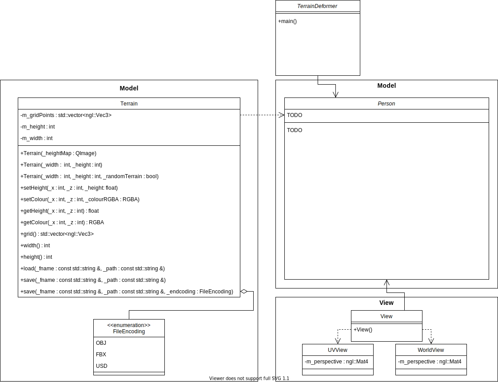

# Ollie Nicholls - Interactive Terrain Deformation and Sculpting

<!-- ## Table of Contents -->
- [Ollie Nicholls - Interactive Terrain Deformation and Sculpting](#ollie-nicholls---interactive-terrain-deformation-and-sculpting)
  - [About the Project](#about-the-project)
  - [References to explore](#references-to-explore)
    - [Existing Tools](#existing-tools)
    - [Videos](#videos)
    - [Concepts and Papers](#concepts-and-papers)
  - [Initial Ideas and Code Design](#initial-ideas-and-code-design)
    - [UML Diagram](#uml-diagram)
  - [Getting Started](#getting-started)
  - [Installation](#installation)
  - [Usage](#usage)

## About the Project

Creating large scale, realistic terrains for VFX is both a time and resource heavy task, with the need for many departments to iterate and adapt a design to suit the desired use.

This tool can *(will be able to)* be used by a user to build, sculpt, texture, interact, modify and iterate existing terrain geometry without the need of a fullscale team. The tool is *(will be)* fully interactive and allows the user to modify lots of terrain properties and also offers brush tools to either dig (adding holes, rivers, caves, or road tunnels) or add terrain (mountains, hills, buildings, or vegetation).

Once a terrain has been created, it can be *(will be)* saved to an either OBJ, FBX or USD file and can be loaded into Maya.

<!-- As the process of film and VFX creation evolves, there is a growing need for the development, iteration and designing of assets to become faster and more interactive. One example of this is the sculpting and generation of large scale CG terrains to form sets or environments for worlds or shots.

These terrains can vary from mountains and cities to deserts and jungles. Traditionally, making any changes to these terrains, preview and try different ideas, would involve many departments to build, sculpt and retexture the geometry, taking days to weeks for results. Your goal for this task is to create a terrain deformation and sculpting toolset that will allow users to directly interact, modify and iterate on existing terrain geometry. You will need to demonstrate a minimum of 2 environment types such as mountains and cities.

The tools should allow them to modify a plethora of the terrains properties, including height, smoothness and material (sand, rock etc). It should also provide a digging tool for creation of holes, caves or rivers for example.

Your system should ensure correct geometry, UVs and normals at all times and should also be able to export the terrain geometry into either OBJ, FBX or USD (if you feel experimental) so that it can be loaded back into Maya. Additionally, it should handle large scale terrains efficiently with good real time performance. The toolset can be developed inside a DCC (Digital Content Creation) tool, or as a standalone application. The only limitation is that Houdini may not be used. You are free to use third party libraries as long as they are open source. It is not required for the sake of this task for the toolset to work in AR/VR. However, if it is possible to do so with controller interaction, this would be very interesting. Note, the focus of this task is on the features, quality of the experience and the usability of each tool provided. Make sure you focus on the key features to produce a quality useable product and explain with accompanying documentation any features not implemented and why. There is always the risk that certain features are harder to implement than initially anticipated. If this is the case, explain in writing why these were hard to complete and provide a suggestion on what is required to complete their implementation. -->

## References to explore

### Existing Tools

- [Terragen](https://planetside.co.uk/) - a powerful solution for building, rendering, and animating realistic natural environments.
- [Daylon Leveller](http://hme.sourceforge.net/) - combines intuitive pixel sculpting with the accuracy of georeferencing and vector shapes.
- [Height Map Editor](http://hme.sourceforge.net/) - 2D program for creating, manipulating, and viewing height maps.
- [Advanced Landscape Editor](http://www.dyvision.co.uk/ale.htm) - Create large scale landscapes and edit textures with direct painting.
- [Kashmir 3D](https://www.kashmir3d.com/index-e.html) - Old tool for making 3D landscapes
- [L3DT](http://www.bundysoft.com/L3DT/) - a Windows application for generating terrain maps and textures. It is intended to help game developers and digital artists create vast high-quality 3D worlds.
- [EarthSculptor](http://www.earthsculptor.com/) - a realtime terrain height-map editor and paint program featuring an easy to use interface designed
exclusively for rapid development of 3D landscapes for visualization, multimedia and game development.
- [TerraNoise](https://www.guruware.at/main/index.html) - Node based terrain editor.

### Videos

- [Potch Explains Perlin Noise with Terrain Generation!](https://www.youtube.com/watch?v=ww5CcgG34Dc)
- [PROCEDURAL TERRAIN in Unity! - Mesh Generation](https://www.youtube.com/watch?v=64NblGkAabk)
- [River Based Terrain Generation - Sapiens Devlog 36](https://www.youtube.com/watch?v=yZHe-2Gg6zA)
- [Procedural Landmass Generation (E01: Introduction)](https://www.youtube.com/watch?v=wbpMiKiSKm8)

### Concepts and Papers

- [Artificial Terrain Generation](http://vterrain.org/Elevation/Artificial/) - Outlines details for many types of generation including information on [caves](http://vterrain.org/Elevation/Caves/). Also contains loads of links to papers on terrain generation:
  - [Terrain generation using procedural models based on hydrology](https://dl.acm.org/doi/abs/10.1145/2461912.2461996)
  - [Terrain Synthesis from Digital Elevation Models](http://www.howardzzh.com/research/terrain/)
  - [Real-Time Editing, Synthesis, and Rendering of Infinite Landscapes on GPUs](https://www.researchgate.net/profile/Jens_Schneider/publication/228909493_Real-Time_Editing_Synthesis_and_Rendering_of_Infinite_Landscapes_on_GPUs/links/0fcfd50a2c4bacf8fb000000/Real-Time-Editing-Synthesis-and-Rendering-of-Infinite-Landscapes-on-GPUs.pdf)
  - [Heightfield Synthesis by Non-Parametric Sampling](https://citeseerx.ist.psu.edu/viewdoc/download?doi=10.1.1.103.2245&rep=rep1&type=pdf)
  - [Modeling for the Plausible Emulation of Large Worlds](https://www.elibrary.ru/item.asp?id=5283463)
  - [TEXTURING & MODELING: A Procedural Approach](http://elibrary.lt/resursai/Leidiniai/Litfund/Lithfund_leidiniai/IT/Texturing.and.Modeling.-.A.Procedural.Approach.3rd.edition.eBook-LRN.pdf)
  - [Generalized Stochastic Subdivision](http://scribblethink.org/Work/Gsd/gsd.pdf)
  - [Computer rendering of stochastic models](https://dl.acm.org/doi/abs/10.1145/358523.358553)
  - [Physically Based Terrain Generation : Procedural Heightmap Generation Using Plate Tectonics](https://www.theseus.fi/handle/10024/40422)
  - [Terrain simulation using a model of stream erosion](https://dl.acm.org/doi/10.1145/378456.378519)
- [Generating Complex Procedural Terrains Using the GPU](https://developer.nvidia.com/gpugems/gpugems3/part-i-geometry/chapter-1-generating-complex-procedural-terrains-using-gpu) - NVIDIA book about terrain generation.
- [Procedural Generation](https://en.wikipedia.org/wiki/Procedural_generation) - Wikipedia
- [PCG-Based game design: enabling new play experiences through procedural content generation](https://dl.acm.org/doi/abs/10.1145/2000919.2000926) - Paper describing how games like Rust, Minecraft, and The Forest use PCG to create terrains.
- [Inside ’no man’s sky,’ the most innovative game in years](https://time.com/no-mans-sky/) - TIME article on how No Man's Sky does terrain generation.

## Initial Ideas and Code Design

Using MVC pattern

Model:

- `Terrain` - An object that has a `std::vector` of grid points (`ngl::Vec3`) that represent the terrain. Each grid point is represented by an `ngl::Vec3` for position in space and an `ngl::Vec3` for colour (, could also include material type).
  - Contains methods for manipulating the terrain
    - `setColour(_x, _z, _colourRGBA)` - change the colour of the point, used for texturing
    - `setHeight(_x, _z, _height)` - change the height of the point, used for raising/lowering the terrain

View:

- `UVView` - A 2D view of the height map that represents the terrain
- `3DView` - A perspective, world view of the rendered terrain

Controller:

- UI System - Controls the whole system.
  - Window that handles the display of the program
  - UI with different tools and brushes to manipulate the terrain

    Initial tools:

    - Zoom tool
    - Excavator brush - brush size, shape, soft edges
    - Building brush - brush size, shape, soft edges
    - Colour changer - interactive colour wheel, brush size, shape, paint by elevation
    - Load texture
    - Load/save object - file types
    - Load/save height map
    - Interactive help (tooltips?)
    - View modes
      - Wire frame
      - Normals
      - Colour on height

    Other tools (time permitting/further extensions)
    - Cave digger
    - River digger (using natural hydrology algorithms, or manual)
    - Mountain builder
    - Sand dune builder
    - Terrain object brush
    - Vegetation

  - The terrain changes colour where the mouse is hovering (amount of points affected based on brush size) - will have to consider how points will be selected, need to check if points in circle. [Converting screen space cursor position to world space](https://stackoverflow.com/a/7702895).

The terrain will need to be tessellated to help with the realtime part of the program. The underlying mesh will be relatively simple but using a tesselation control shader, different parts of the model will have different levels of detail depending on how vital it is that the object looks smooth. For example, a sheer mountain face will not need as much detail (and will not have as many nooks and crannies) as a cave which would look relatively smooth or have distinct shapes that need a higher level of detail.

I'm keen on the idea of trying to use (or at least a simulation of) real geology  to generate mountains, rivers, and caves as I feel it will create more realistic looking terrain.

Further research into whether this would be a single-pass render or multi-pass, I can see benefits to both methods presently.

### UML Diagram

## Getting Started

TODO

## Installation

TODO

## Usage

TODO
