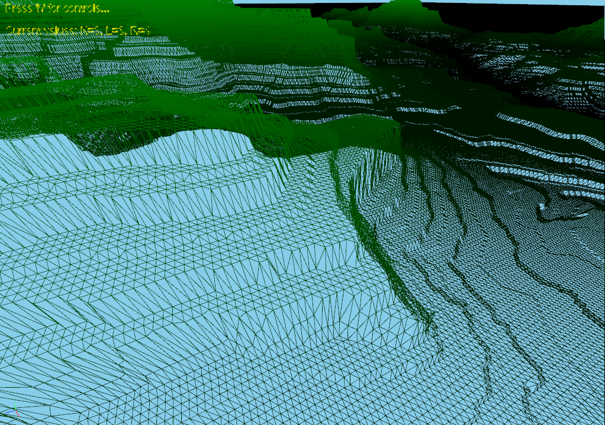
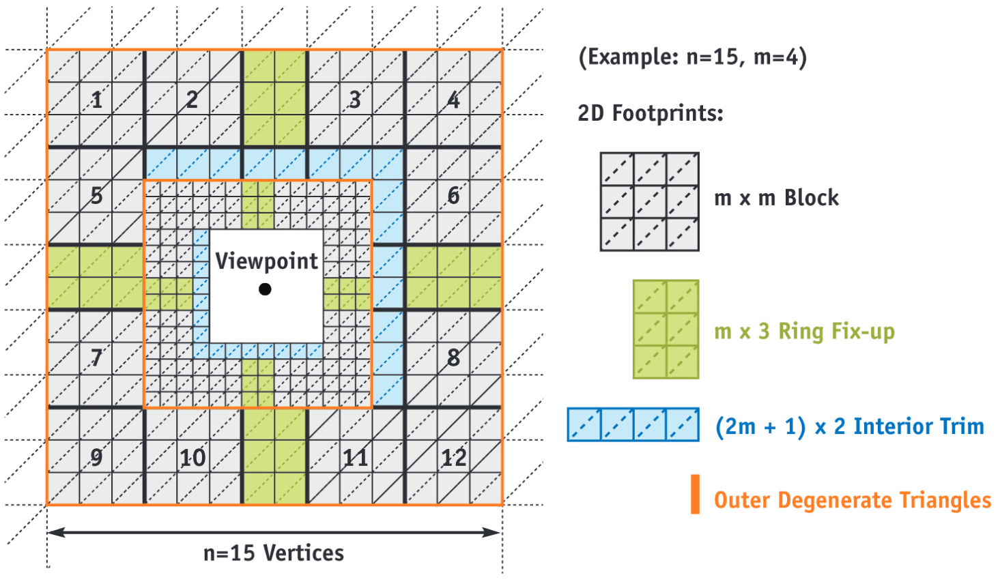

# Ollie Nicholls - Terrain Representation using Geometry Clipmaps

<!-- ## Table of Contents -->
- [Ollie Nicholls - Terrain Representation using Geometry Clipmaps](#ollie-nicholls---terrain-representation-using-geometry-clipmaps)
  - [About the Project](#about-the-project)
  - [Installation](#installation)
    - [Pre-requisites](#pre-requisites)
    - [Building](#building)
  - [Usage](#usage)
    - [Settings](#settings)
  - [Technical Design](#technical-design)
    - [How the algorithm works](#how-the-algorithm-works)
    - [Main Components](#main-components)
      - [Manager.cpp](#managercpp)
      - [Terrain.cpp](#terraincpp)
      - [Heightmap.cpp](#heightmapcpp)
      - [ClipmapLevel.cpp](#clipmaplevelcpp)
      - [Footprint.cpp](#footprintcpp)
      - [Terrain Vertex Shader](#terrain-vertex-shader)
    - [High-level System Diagram](#high-level-system-diagram)
  - [References and Acknowledgements](#references-and-acknowledgements)
    - [Existing Tools](#existing-tools)
    - [Videos](#videos)
    - [Concepts and Papers](#concepts-and-papers)

## About the Project

With GPU processing becoming more and more advanced each year, hundreds of algorithms  that  try  to  tackle  the  complex  task  of  3D-model  representation  have  been created.   These  algorithms,  often  referred  to  as  level-of-detail  (LOD)  systems,  have been created to try to tackle displaying terrains in the most efficient way.  

My project implements one of these LOD algorithms, namely the [Geometry Clipmap Algorithm](https://citeseerx.ist.psu.edu/viewdoc/download?doi=10.1.1.146.3203&rep=rep1&type=pdf), and uses computer graphics techniques from this and the other papers mentioned in my report and at the bottom of this page.

Having a suitable and efficient LOD algorithm in place, paves the way for terrain modification and random generation on a massive scale, which this project could be used for in the future.

|                 Grand Canyon (K = 9)                  |                      Grand Canyon (K = 9, wireframe)                      |
| :---------------------------------------------------: | :-----------------------------------------------------------------------: |
|  |  |

|                     Grand Canyon (K = 5)                      |                          Grand Canyon (K = 5, wireframe)                          |
| :-----------------------------------------------------------: | :-------------------------------------------------------------------------------: |
|  |  |

## Installation

### Pre-requisites

See the [NGL Pre-requisites and Building](https://github.com/NCCA/NGL#pre-requisites) chapters.

At a high level, install vcpkg, and run the following commands:

```bash
.\vcpkg install gtest:x64-windows
.\vcpkg install glm:x64-windows
.\vcpkg install glfw3:x64-windows
.\vcpkg install openimageio:x64-windows
.\vcpkg install rapidjson:x64-windows
.\vcpkg install rapidxml:x64-windows
.\vcpkg install fmt:x64-windows
.\vcpkg install pybind11:x64-windows
.\vcpkg install freetype:x64-windows
.\vcpkg install ilmbase:x64-windows
.\vcpkg install openexr:x64-windows
```

then install NGL as shown in the above link.

### Building

- Clone this repo
- `cd ase-cgitech-Olluo`
- Create a build directory (`mkdir build`)
- `cd build`
- Run `cmake ..`, this will build the project files
- Run `cmake --build .`, this will build the project


## Usage

Once built using the instructions above

- `cd Debug`
- Run `./GeoClipmapDemo.exe <heightmap_image_file>`

This will then display the heightmap at `<heightmap_image_file>` using the GeoClipmap algorithm.

There are 4 heightmaps included (inside the `img/tests` directory):

- `ben_nevis.png` - 10x10km from Ben Nevis to Fort William
- `cheddar.png` - 10x10km area centred around Cheddar Reservoir (where I went to school)
- `grand_canyon.png` - 10x10km area centred around the Grand Canyon Village
- `poole_harbour.png` - 10x10km area of Poole Harbour near Bournemouth

|            `ben_nevis.png`            |           `cheddar.png`           |             `grand_canyon.png`              |              `poole_harbour.png`              |
| :-----------------------------------: | :-------------------------------: | :-----------------------------------------: | :-------------------------------------------: |
|  |  |  |  |

### Settings

To display the settings press the 'h' key and the following settings will be displayed in the top left:

```bash
===== CONTROLS =====
= 'arrow keys' - move terrain (always follows world axes)
= '[' - reduce LOD, ']' - increase LOD (K)
= '-' - reduce clipmap count, '=' - increase clipmap count (L)
= '9' - reduce clipmap range, '0' - increase clipmap range (R)
= 'LMB' - orbit camera, 'MMB' - pedestal camera (up/down), 'RMB' - dolly camera (in/out)
= 'spacebar' - reset camera
= 'F11' - toggle fullscreen
= 'Esc' - quit
= 'w' - toggle wireframe
= 'h' - to hide these controls
====================
```

The current GeoClipmap settings are always displayed in the top left, an example configuration is as follows:

```bash
Current values: K=8, L=10, R=4
```

which can be translated to:

- The current resolution of all clipmap levels (LOD) is set to 8 meaning that each clipmap level is sized (2^8) - 1 in width and height
- The current number of clipmap levels generate from finest to coarsest is 10 levels
- The number of levels to display at a time is 4 levels (as only the required active levels need to be shown)

## Technical Design

See section 3 of the [report](docs/report.pdf) for a high-level description of the project specification and plan.

This project was originally going to include terrain *modification* and *creation* but this was too much work for the time frame. Therefore, only the *representation* of terrain has been tackled which was the main goal of the project.

### How the algorithm works

At a high level, here is how the algorithm works - taken from [my report](docs/report.pdf).



In geometry clipmaps, the X-Z coordinates are represented by a few vertices and indices, with terrain data being cached in a set of nested grids centred around the viewer.  

Each grid is stored as a constant vertex buffer made up of four different “footprints” in video memory, whilst the height data is stored as a texture buffer to be read in the vertex shader.  

The terrain is filtered into a power-of-two mipmap pyramid, with the mipmap being rendered at each pixel being a function of screen-space and parametric derivatives based on the view parameters, not the actual content of the image.

The texture clipmap is then updated in fast incremental stages allowing massive landscapes to be traversed with no drop in frames. The LOD level for each clipmap is selected based on the viewer height. This makes every triangle the same amount of pixels on screen, as each clipmap is just the finest clipmap but at power-of-two scales.

Geoclipmaps have several advantages over  other LOD  methods. These advantages include them being moderately simple to implement, having an optimal rendering throughput, retaining visual continuity across clipmaps, and providing complexity throttling that prevents GPU throttling.  This works by rendering from the coarsest detail to finest, dropping the finest level if the viewer has moved before rendering.

### Main Components

The system is split into two main parts; the algorithm and associated parts that compiles into `geoclipmap.lib` and the computation for displaying the scene. I will only highlight the main components in the library.

#### [Manager.cpp](src/Manager.cpp)

This class handles the storing and management of the main variables in the GeoClipmap algorithm. It is a singleton class and can be used to get a certain parameter when needed in a calculation. The list of parameters are as follows:

| Parameter | Description                                                           |
| :-------: | --------------------------------------------------------------------- |
|    `K`    | The level of detail                                                   |
|    `D`    | The equivalent of 2^K                                                 |
|    `N`    | The grid size for each clipmap level                                  |
|    `M`    | The equivalent of D / 4 and the width of the footprints               |
|   `D2`    | The equivalent of D / 2                                               |
|    `H`    | How much to move from the clipmap level edge to find the centre point |
|    `L`    | The number of clipmap levels                                          |
|    `R`    | The number of clipmap levels to show from finest to coarsest          |

These parameters can be adjusted using the keybindings stated in [Settings](#settings).

#### [Terrain.cpp](src/Terrain.cpp)

The main GeoClipmap class that manages all the subcomponents and creates the whole clipmap. This is the class that is made in the main NGLScene.cpp.

It is constructed from a Heightmap.

Firstly, it generates all the footprint types required (as seen in the [table below](#footprintcpp)) using the current settings from the manager to get the M values that are used for the widths of each of the footprints. It makes one block footprint, a horizontal and vertical fixup footprint, a horizontal and vertical trim footprint, and an outer degenerate ring footprint, and then these are stored in a map to be used by all clipmap levels when drawing.


Next it generates all the possible locations for these footprints. There are 25 different locations and as each clipmap is positioned in local space based on the bottom left corner being at `(0, 0)` and each footprint has a set size, the positions of each can be calculated easily (as seen in the Footprint Location Calculations image). These are all added to a vector in a specific order so that subsets can be used depending on the configuration of each clipmap (for example, the finest clipmap needs all footprints as it doesn't have an interior clipmap, whereas a clipmap whose position means that the trim should be top and left will not need the interior blocks or bottom and right trims).

Next, all the clipmap levels are constructed in coarse-to-fine order as each finer level needs a reference to its parent.

Finally, the position of the terrain is updated, which in turn signals all the clipmap levels to update position (in fine-to-coarse order), then to generate their texture based on their location (in coarse-to-fine order). The algorithm to choose the positions for each clipmap level works as follows:

1. Set initial variables for the clipmap offset, previous position, and offset of each clipmap
2. Starting with the finest clipmap and looping to the coarsest
   1. Get integer values of the terrain position
   2. If this clipmap is the active finest then set its trim location to display all footprints
   3. Otherwise, using the position and scale, perform a logical and to determine the position of the clipmap (as the scales are all powers of 2, the bit of the scale can be used with the position to determine where this level should be. e.g. scale = 4 == 0100, xPos = 5 == 0101, xPos & scale = 0100 > 0 therefore clipmap on the left).
   4. Set the position of the clipmap level
   5. Divide the position by 2 (as each clipmap is double scale of the previous) and set previous position to this value
3. Finally, loop from coarse-to-fine generating the textures for each clipmap

Whilst it seems complicated, this algorithm is quite logical and reading through the code should help to understand it slightly better.

#### [Heightmap.cpp](src/Heightmap.cpp)

A class that stores a heightmap image (like the ones mentioned in [Usage](#usage)) and can be queried by the clipmap levels to generate their textures.

This simply takes a list of pixel values (colours represented as `Vec3`s) and stores it in a `std::vector`. This data is then accessed in the `colour(x, y)` and `value(x, y)` methods and returns the data in the vector at the index of `y * heightmap.width + x`.

#### [ClipmapLevel.cpp](src/ClipmapLevel.cpp)

Represents one level of the GeoClipmap and has a scale and position based on where the viewer is in the world.

Each clipmap level has an associated texture buffer that stores a texture using `GL_RG32F` which is a 2D vector of float values which is used as the height for each vertex of the clipmap. The texture is populated by getting the clipmap levels position, and using this along with its scale to get pixel data from the heightmap, based on the heightmaps position.

Unfortunately, I couldn't get a part of the algorithm working here. There is supposed to be a blend region between clipmap levels to hide any t-junctions in the mesh. This worked by each texture having information about the parent clipmaps texture, and then at the edges of the clipmap, it would linearly blend between the two levels.

I have implemented the code (but commented it out) to get an averaged height of the parent texture (as there isn't a one-to-one position for all coordinates) and it works by calculating if each pixel is positioned at odd or even, x or y, and then uses this to average the even values around this point from the parent clipmap.

I took a slightly different approach to the original algorithm here and used a 2D-vector for each texture value with R being the fine data and G being the coarse data however the coarse data is never used due to the issue mentioned.

#### [Footprint.cpp](src/Footprint.cpp)

Represents one of the four different footprints in the algorithm:

|       Footprint       |        Dimension         | Use                                                                    |
| :-------------------: | :----------------------: | ---------------------------------------------------------------------- |
|         Block         |        `M` by `M`        | 12 used as the main building blocks of the clipmap level               |
|         Fixup         |        `M` by `3`        | 4 used between the blocks to space them correctly                      |
|     Interior Trim     |    `(2M + 1)` by `2`     | 2 used on most level, 4 on finest level to space finer level correctly |
| Outer Degenerate Ring | `(4M - 1)` by `(4M - 1)` | 1 per level, serves as the outer border                                |

The vertices are calculated by simply looping along from 0 to the width, and 0 to the depth and assigning a value based on the loop value. Notice, all vertices start at `(0, 0)` for all footprints and should then be drawn on top of each other, however, this isn't the case as the vertices are moved in the vertex shader.

For the outer degenerate ring, the vertices don't include values in the centre of the square as it is only a ring of degenerate triangles (triangles with no area).

The indices are calculated taking into account triangle strips. This loops through each row of vertices, and vertices in the next row to make the triangle strips. The OpenGL instruction `GL_PRIMITIVE_RESTART_FIXED_INDEX` is used to reset the triangle strips at the end of each row by adding an index with a value of `std::numeric_limits<GLuint>::max()` which is the max value a `GLuint` can have.

With the outer degenerate ring, instead the strips aren't restarted and vertices are used multiple times to create degenerate triangles around the whole ring.

Each footprint has an associated `FootprintVAO` that it can use to bind data and draw.

#### [Terrain Vertex Shader](shaders/terrain.vert.glsl)

This shader is where the height data is fetched from the texture and used with the vertex buffer to position each vertex.

It works by taking the vertex, the footprint position in the clipmap, the offset of the clipmap, sums these all together, and multiplies it by the scale of the clipmap to get the `(x, y)` coordinates of the vertex. The `z` part of the vertex (note here, x & y are used as the horizontal coordinates, and z is the vertical coordinate as the whole terrain is rotated to be correct when displayed) is retrieved from the texture buffer using just the in-vertex and the footprint location to get the correct texture point.

Here is where the height blending of the outer regions of each clipmap would be but unfortunately I couldn't get it working. The basic premise is that an alpha value used to blend between the fine clipmap and the coarse parent clipmap would be used. This value's calculation is a formula that will return 0 except when in the outer 10th of the clipmap.

The colour for each vertex is only in green and is a percentage of the highest point in the clipmap. I could have done some nice normal colouring and shadows etc. in the fragment shader but this was only meant to show off the algorithm and therefore I felt it was unnecessary to spend time on it.

### High-level System Diagram

Based on the main components above, here is a high-level overview of the system:


## References and Acknowledgements

Here is a list of other references and acknowledgements not mentioned in my report that were used during the development of this project.

### Existing Tools

- [Terragen](https://planetside.co.uk/) - a powerful solution for building, rendering, and animating realistic natural environments.
- [Daylon Leveller](http://hme.sourceforge.net/) - combines intuitive pixel sculpting with the accuracy of geo-referencing and vector shapes.
- [Height Map Editor](http://hme.sourceforge.net/) - 2D program for creating, manipulating, and viewing height maps.
- [Advanced Landscape Editor](http://www.dyvision.co.uk/ale.htm) - Create large scale landscapes and edit textures with direct painting.
- [Kashmir 3D](https://www.kashmir3d.com/index-e.html) - Old tool for making 3D landscapes
- [L3DT](http://www.bundysoft.com/L3DT/) - a Windows application for generating terrain maps and textures. It is intended to help game developers and digital artists create vast high-quality 3D worlds.
- [EarthSculptor](http://www.earthsculptor.com/) - a realtime terrain height-map editor and paint program featuring an easy to use interface designed
exclusively for rapid development of 3D landscapes for visualization, multimedia and game development.
- [TerraNoise](https://www.guruware.at/main/index.html) - Node based terrain editor.

### Videos

- [Potch Explains Perlin Noise with Terrain Generation!](https://www.youtube.com/watch?v=ww5CcgG34Dc)
- [PROCEDURAL TERRAIN in Unity! - Mesh Generation](https://www.youtube.com/watch?v=64NblGkAabk)
- [River Based Terrain Generation - Sapiens Devlog 36](https://www.youtube.com/watch?v=yZHe-2Gg6zA)
- [Procedural Landmass Generation (E01: Introduction)](https://www.youtube.com/watch?v=wbpMiKiSKm8)

### Concepts and Papers

- [Artificial Terrain Generation](http://vterrain.org/Elevation/Artificial/) - Outlines details for many types of generation including information on [caves](http://vterrain.org/Elevation/Caves/). Also contains loads of links to papers on terrain generation:
  - [Terrain generation using procedural models based on hydrology](https://dl.acm.org/doi/abs/10.1145/2461912.2461996)
  - [Terrain Synthesis from Digital Elevation Models](http://www.howardzzh.com/research/terrain/)
  - [Real-Time Editing, Synthesis, and Rendering of Infinite Landscapes on GPUs](https://www.researchgate.net/profile/Jens_Schneider/publication/228909493_Real-Time_Editing_Synthesis_and_Rendering_of_Infinite_Landscapes_on_GPUs/links/0fcfd50a2c4bacf8fb000000/Real-Time-Editing-Synthesis-and-Rendering-of-Infinite-Landscapes-on-GPUs.pdf)
  - [Heightfield Synthesis by Non-Parametric Sampling](https://citeseerx.ist.psu.edu/viewdoc/download?doi=10.1.1.103.2245&rep=rep1&type=pdf)
  - [Modeling for the Plausible Emulation of Large Worlds](https://www.elibrary.ru/item.asp?id=5283463)
  - [TEXTURING & MODELING: A Procedural Approach](http://elibrary.lt/resursai/Leidiniai/Litfund/Lithfund_leidiniai/IT/Texturing.and.Modeling.-.A.Procedural.Approach.3rd.edition.eBook-LRN.pdf)
  - [Generalized Stochastic Subdivision](http://scribblethink.org/Work/Gsd/gsd.pdf)
  - [Computer rendering of stochastic models](https://dl.acm.org/doi/abs/10.1145/358523.358553)
  - [Physically Based Terrain Generation : Procedural Heightmap Generation Using Plate Tectonics](https://www.theseus.fi/handle/10024/40422)
  - [Terrain simulation using a model of stream erosion](https://dl.acm.org/doi/10.1145/378456.378519)
- [Generating Complex Procedural Terrains Using the GPU](https://developer.nvidia.com/gpugems/gpugems3/part-i-geometry/chapter-1-generating-complex-procedural-terrains-using-gpu) - NVIDIA book about terrain generation.
- [Procedural Generation](https://en.wikipedia.org/wiki/Procedural_generation) - Wikipedia
- [PCG-Based game design: enabling new play experiences through procedural content generation](https://dl.acm.org/doi/abs/10.1145/2000919.2000926) - Paper describing how games like Rust, Minecraft, and The Forest use PCG to create terrains.
- [Inside ’no man’s sky,’ the most innovative game in years](https://time.com/no-mans-sky/) - TIME article on how No Man's Sky does terrain generation.

<!-- quaternions -->

<!-- #### Representation

This part of the project will rely on loading in a predefined heightmap. Basic **saving** and **loading** will also be available at this stage.

Main Goal: Trying to get a terrain grid shown to the screen in an efficient way - will use the algorithms described in the report, based on [Geoclipmaps](https://webpages.uncc.edu/krs/courses/6127/pubs/mesh/losasso-siggraph-2004.pdf) and [NVIDIA's GPU Gems 2: Terrain Rendering Using GPU-Based Geometry Clipmaps](https://citeseerx.ist.psu.edu/viewdoc/download?doi=10.1.1.146.3203&rep=rep1&type=pdf).

- The data will be split into an X-Z vertex and index buffer for each footprint, a texture buffer that represents the height data at each vertex, and some normal and colour data.
- LOD levels span from fine to coarse around the viewer toroidally based on the position of the camera.
- The terrain world is seemingly infinite with the heightmap loaded in to the origin.
- A region of the world can be saved to an object file.
- The performance (FPS/memory usage) can be seen on screen.

Secondary Goal: Texturing terrain

- How to texture based on height?
- Is it possible for users to define own textures?
- Can you simulate biomes/different texturing approaches?
- Having sun position, setting a skybox texture?

Could use [Scape Rendering](https://www.decarpentier.nl/scape-render)'s way of projecting textures onto steep surfaces using a horizontal texture map.

#### Modification

This step I am splitting from creation as this will handle basic brushes (excavator, builder) and other modifications that don't require procedurally generating parts of the terrain.

- How to modify the height of existing terrain in a user-friendly way?
- How to change colours of terrain sections?
- How to set certain areas' biome? (want to deliver at least 2 maybe 3 different biomes)

#### Creation

This step will cover all the procedural generation brushes and only be done if time permits.

- What algorithms to use for building mountains, rivers, caves, chasms, oceans etc.?

#### High-Level Code Design

Using MVC pattern

Model:

- `Terrain` - An object that has a `std::vector` of grid points (`ngl::Vec3`) that represent the terrain. Each grid point is represented by an `ngl::Vec3` for position in space and an `ngl::Vec3` for colour (, could also include material type).
  - Contains methods for manipulating the terrain
    - `setColour(_x, _z, _colourRGBA)` - change the colour of the point, used for texturing
    - `setHeight(_x, _z, _height)` - change the height of the point, used for raising/lowering the terrain

View:

- `UVView` - A 2D view of the height map that represents the terrain
- `3DView` - A perspective, world view of the rendered terrain

Controller:

- UI System - Controls the whole system.
  - Window that handles the display of the program
  - UI with different tools and brushes to manipulate the terrain

    Initial tools:

    - Zoom tool
    - Excavator brush - brush size, shape, soft edges
    - Building brush - brush size, shape, soft edges
    - Colour changer - interactive colour wheel, brush size, shape, paint by elevation
    - Load texture
    - Load/save object - file types
    - Load height map
    - Interactive help (tooltips?)
    - View modes
      - Wire frame
      - Normals
      - Colour on height

    Other tools (time permitting/further extensions)
    - Cave digger
    - River digger (using natural hydrology algorithms, or manual)
    - Mountain builder
    - Sand dune builder
    - Terrain object brush
    - Vegetation

  - The terrain changes colour where the mouse is hovering (amount of points affected based on brush size) - will have to consider how points will be selected, need to check if points in circle. [Converting screen space cursor position to world space](https://stackoverflow.com/a/7702895) see NGL unproject function.

The terrain will need to be tessellated to help with the realtime part of the program. The underlying mesh will be relatively simple but using a tesselation control shader, different parts of the model will have different levels of detail depending on how vital it is that the object looks smooth. For example, a sheer mountain face will not need as much detail (and will not have as many nooks and crannies) as a cave which would look relatively smooth or have distinct shapes that need a higher level of detail.

I'm keen on the idea of trying to use (or at least a simulation of) real geology  to generate mountains, rivers, and caves as I feel it will create more realistic looking terrain.

Further research into whether this would be a single-pass render or multi-pass, I can see benefits to both methods presently.

Ideas/scratch pad:

- Terrain texturing could be done based on height/slope (If above certain level texture as snow, if cliff then texture as cliff face not grass). Could have biome selection to change what the texturing does (no snow and texture as sand if desert)
- Research into different view modes for items based on distance to camera - higher resolution if close to camera and low resolution in distance to improve speed/performance.
- Sun/light direction
- Skybox texture
- texture readback?
- staging textures?
- linear interpolation between colours to colour vertices
- procedural brushes
- using gpu for rendering and brush work
- Geometric mip mapping
- texture splatting
- contours?
- Lock mouse to height -->

<!-- #### UML Diagram

< -->
